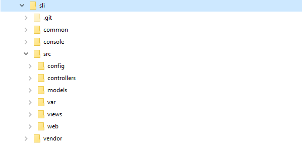

## Slim4-Mod auto-route

**Tác giả:** Phi Hùng - vmkeyb908@gmail.com - (VN) 0974 471 724

---

Slim4-MVC tiny and faster MVC framework for PHP

Các bổ sung và hiệu chỉnh là tối thiểu dể bạn có thể sử dụng MVC với slim4.

>
>*Đặc biệt:* 
>	* Có thể chạy nhiều website như từng module riêng lẻ trên một framework slimMVC duy nhất.
>	* Nó sẽ nạp các route với tính chất động (dynamic) mỗi khi người dùng gõ vào một URL nào đó. Do vậy hệ thống sẽ hoạt động nhanh và ít tốn bộ nhớ vì không mất qui trình "init" chưa cần dùng đến.   
>	* View mặc định là PHP, bạn có thể dùng Smary (đặt phần mở rộng của view là .tpl) hoặc Twig (.twig) - Hệ thống sẽ nạp code động (lazy-dynamic load) khi bạn sử dụng một trong các loại kết xuất "view".
>

---

**Cài đặt:**

```markdown

* Cài đặt lần đầu: Chuyển đến thư mục www (Document root), dán dòng lệnh dưới và bấm Enter (slimMVC là tên tùy chọn).

composer create-project slim4-mod/mvc:"dev-master" ./slimMVC

* Cập nhật core (khi có phiên bản mới):

composer require slim-mvc/core "dev-master"

```

##### * Cấu hình Apache:

**httpd.conf:**

	Define SRVROOT "D:/Path-to/Apache24"
	Define SRVROOTV "${SRVROOT}/../www"

**httpd-vhosts.conf:**

*localhost*

	<Directory ${SRVROOTV}>
		Options Indexes FollowSymLinks
		AllowOverride All
		Require all granted
		
		RewriteCond %{REQUEST_FILENAME} !-f
		RewriteCond %{REQUEST_FILENAME} !-d
		RewriteRule ^ index.php [QSA,L]
		FallbackResource /index.php
		
		RewriteEngine on
		RewriteRule ^/sslim/(.*) /sslim/index.php/$1 [QSA,L]
	</Directory>
	<VirtualHost *:80>
		AddDefaultCharset UTF-8
		DocumentRoot "${SRVROOTV}"
		ServerName localhost
		ErrorLog "logs/localhost-error.log"
		CustomLog "logs/localhost-access.log" common
	</VirtualHost>

---

*subdir:*

	Alias /sslim "${SRVROOTV}/slimMVC/src/web" 
	<VirtualHost *:80>
		ServerName localhost
		ErrorLog "logs/localhost-error.log"
		CustomLog "logs/localhost-access.log" common
		
		DocumentRoot "${SRVROOT}/slimMVC/src/web"
		<Directory "${SRVROOT}/slimMVC/src/web">
			Options Indexes FollowSymLinks
			AllowOverride None
			Require all granted
			
			RewriteCond %{REQUEST_FILENAME} !-f
			RewriteCond %{REQUEST_FILENAME} !-d
			RewriteRule ^ index.php [QSA,L]
			FallbackResource /index.php
		</Directory>
	</VirtualHost>
	<VirtualHost *:80>
		ServerName slim.local #cần khai báo hosts trong window: 127.0.0.1 slim.local
		ErrorLog "logs/slimMVC-error.log"
		CustomLog "logs/slimMVC-access.log" common
		
		DocumentRoot "${SRVROOTV}/slimMVC/src/web"
	</VirtualHost>
	
--

>
>	**Nếu bạn cài đặt lần đầu từ composer thì phần dưới đây đã được thiết lập sẵn, có thể bỏ qua phần này**
>
>	**Quan trọng:** để ngăn truy xuất các thư mục con trong slimMVC, cần tạo slimMVC/.htacces với 1 dòng sau:
>	
>	Require all denied
>	
>	Đồng thời để "mở lại" chức năng truy xuất web, bạn cần tạo file .htacces trước thư mục "web-root" (ở ví dụ trên là thư mục src/.htacces) có 3 dòng sau:
>	
>	Require all granted
>	RewriteEngine on
>	RewriteRule "!web/" - [L,F]
>	RewriteRule ^$ web/ [L]
>	RewriteRule (.*) web/$1 [L]
>

>
>**Chạy thử:**
><br><br>
>- Danh sách người dùng:<br>
>http://slim.local/user/list
><br><br>
>- Người dùng có id = 2:<br> 
>http://localhost/sslim/user/row/2
><br><br>
>- Danh sách người dùng với module **admin**:<br>
>http://localhost/sslim/admin/user/list
><br>
> 

```note

Dữ liệu cấu hình ban đầu được lấy từ bộ nhớ, hãy tạo dữ liệu với bảng user và product...

và vào file \common\config\Repositories.php và đánh dấu XXX ở dòng:

'XXXdynamicRepository' => function( ...

để sử dụng cơ sở dữ liệu từ các bảng đã tạo.

```

<br>

##### Ảnh cấu trúc thư mục:



<br>

##### Cách sử dụng:

>
>Dùng tiện ích dòng lệnh để tự động tạo cấu trúc file cần thiết cho model mới (NEW_MODEL).
>
> ```
> new-model <tên_model_mới>
> ```
>
>Sau khi chạy tiện ích xong bạn có thể gõ 'localhost/NEW_MODEL' vào trình duyệt để thử ngay.
>
>Muốn tham khảo đủ tính năng, bạn cần làm 2 việc chính để sử dụng như MVC-framework:
>
>* 1- Đến thư mục src/models/NEW_MODEL và thiết kế bổ sung ORM cho file NEW_MODEL.php
>
>* 2- Tạo bảng tương thích với NEW_MODEL.
>
> 

<br>

* Qui định bắt buộc:
	- Cấu trúc thư mục như slim4 mẫu đang có. Tất cả thư mục là chữ thường, các file (class) là chữ cái đầu in hoa.
	- Tên các chức năng của "Product" phải có chữ đầu tiên là viết in hoa và nối phía sau là Action (ex: ListAction.php, RowAction.php, ...)

<br>

### HƯỚNG DẪN MỞ RỘNG

<br>

* **Tách website thành từng module:**

>
>	Bạn có thể mở nhiều web site trên một framework slimMVC, hãy thực hiện các bước:
>
>	1- Khai báo tên module trong file common/config/prs4-alias.php (mẫu như dòng admin đã có trong file)
>
>	2- Copy thư mục template-web (hoặc backend, frontend hoặc thư mục nào đó của bạn) thành một bản mới.
>
>	3- Đổi tên thư mục vừa copy thành tên giống module đã khai báo ở bước 1.
>
>	Sau khi hoàn thành, bạn có thể gõ vào *localhost/**admin**/product/list*<br>
>	(**admin** là module đã có sẵn, hãy thay nó bằng tên module của bạn)
>

<br>

* **Assets cho css, js và image -** Hệ thống sẽ tự nạp assets theo một trong 2 cách sau:

>
>
>	a- Nạp class trực tiếp trong file action nếu bạn có khai báo constructor và class (xem mẫu product/listAction.php)
>
>	b- Nạp từ file xxx\controllers\xxx\auto_gen\Asset.php
>
>	* Khai báo AssetClass cho hai cách trên là giống nhau, hãy tham khảo mẫu ListAction và RowAction trong .../product)
>

<br>
<hr>

>
> *Chú thich:* Các tính năng đang trong quá trình thiết kế do vậy cần sự đóng góp của mọi người. Thanks!
>

<hr>
<br>

*Tác giả: Phi-Hùng - vmkeyb908@gmail.com - Readme v.1.3*